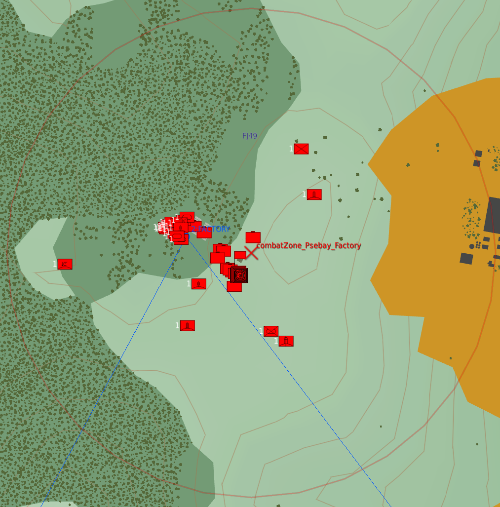
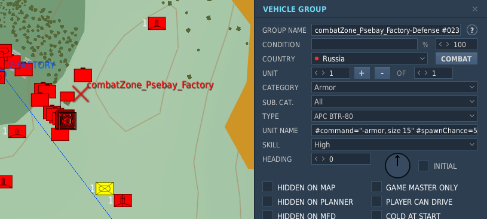
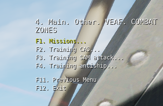

-----------------------------

Navigation: [page "Mission Maker" du site de documentation VEAF](./index.md)

-----------------------------

🚧 **TRAVAUX EN COURS** 🚧

La documentation est en train d'être retravaillée, morceau par morceau. 
En attendant, vous pouvez consulter l'[ancienne documentation](https://github.com/VEAF/VEAF-Mission-Creation-Tools/blob/master/old_documentation/_index.md).

-----------------------------

# Table des matières

- Principes - [ici](#principes)
- Configuration - [ici](#comment-configurer-une-combat-zone)
- Exemples - [ici](#exemples-complets)

# Introduction

Le module *Combat Zone* permet de créer facilement des zones qu'on peut déclencher à la demande, et qui peuvent contenir des groupes DCS (unités sol, navires, hélicoptères) - avec leurs waypoints et leurs instructions, des commandes VEAF (comme celles qu'on peut déclencher dans un marqueur sur la carte F10).

# Principes

Une *Combat Zone* est constituée de :
- une zone, définie par une trigger zone DCS placée dans l'éditeur de mission (circulaire ou quadpoint)
- un ou des groupes DCS, statiques, ou unités dont le nom contient une commande VEAF (exemple: `-armor`, `-shell`, `_spawn zu-57`)
- des paramètres (dans `missionConfig.lua`)

Une fois configurée, une entrée sera ajoutée dans le menu radio VEAF, comprenant ces commandes:
- "Get info": obtenir des informations sur la zone et son état. En particulier:
  - le briefing configuré dans les paramètres
  - les unités alliées restant dans la zone (y compris le détail des unités - type, nombre - si la zone est paramétrée en "training")
  - les unités ennemies restant dans la zone (y compris le détail des unités - type, nombre - si la zone est paramétrée en "training")
  - les coordonnées du centre de la zone
  - la météo sur la zone
- "Activate zone" si la zone n'est pas encore active
- "Desactivate zone" si la zone est active
- "Request RED smoke on target" pour demander une fumée rouge sur le centre de la zone (ou l'épicentre des ennemis restants, si la zone est paramétrée en "training")
- "Request illumination flare on target" pour demander une fusée d'éclairage sur le centre de la zone (ou l'épicentre des ennemis restants, si la zone est paramétrée en "training")

Le menu radio est sécurisé ; par défaut il faut être connecté (`/secu login`) pour pouvoir activer ou désactiver des zones (sauf celles qui sont en mode "entrainement").

Et enfin, il faut ajouter la zone nouvellement créée à la bibliothèque des combat zones, en utilisant la fonction `veafCombatZone.AddZone`.

## Exemple de la zone "Psebay factory" dans l'OpenTraining Caucase

*Le code dans `missionConfig.lua`:*

```lua
veafCombatZone.AddZone(
  VeafCombatZone:new()
    :setMissionEditorZoneName("combatZone_Psebay_Factory")
    :setFriendlyName("Psebay chemical weapons factory")
    :setRadioGroupName("Missions")
    :setBriefing(
[[This factory manufactures chemical weapons for a terrorist group
You must destroy both factory buildings, and the bunker where the scientists work
"The other enemy units are secondary targets]])
)
```

*La trigger zone et les unités dans l'éditeur de mission:*



*Le détail d'une unité qui déclenchera une commande VEAF (ici avec des options):*



*Le menu radio de cette zone de combat:*



# Déclarer une *Combat Zone* dans le fichier de configuration

Tout commence dans le fichier de configuration de la mission `missionConfig.lua`, qui est situé dans le répertoire `src/scripts` de votre mission.

Ce dernier est un fragment de code source [LUA](https://fr.wikipedia.org/wiki/Lua) qui permet de choisir la manière dont les scripts VEAF sont activés et configurés. Nous vous conseillons d'utiliser Notepad++ ou Visual Studio Code pour l'éditer.

Par défaut, si vous avez utilisé le [convertisseur de mission existante][VEAF-mission-converter-repository] pour préparer votre dossier de mission VEAF, il contient déjà un modèle de configuration QRA que vous pourrez trouver en cherchant `-- configure COMBAT ZONE`.

Le principe de configuration est simple.

Tout d'abord on crée un "objet" de type *VeafCombatZone* en appelant `VeafCombatZone:new()`. Cet appel renvoie une instance de *VeafCombatZone*, qu'on peut stocker dans une variable (`local maZone = VeafCombatZone:new()`) ou utiliser tout de suite avec une [désignation chaînée](https://fr.wikipedia.org/wiki/D%C3%A9signation_cha%C3%AEn%C3%A9e) (en enchainant les appels aux méthodes de configuration qui renvoient toutes, tour à tour, la même instance de *VeafCombatZone*).

<u>Exemple de chainage:</u>

```lua
VeafCombatZone:new()
    :setMissionEditorZoneName("combatZone_CrossKobuleti")
	:setFriendlyName("Cross Kobuleti")
```

L'avantage de cette méthode est sa simplicité.

<u>Exemple d'utilisation d'une variable:</u>

```lua
local zoneCrossKobuleti = VeafCombatZone:new()
zoneCrossKobuleti:setMissionEditorZoneName("combatZone_CrossKobuleti")
zoneCrossKobuleti:setFriendlyName("Cross Kobuleti")
```

L'avantage de la seconde méthode est qu'on peut, plus loin dans le fichier `missionConfig.lua`, utiliser une référence à la variable qu'on a définie pour accéder à l'instance de *VeafCombatZone* (par exemple, dans la définition d'un alias, d'une commande "mission maker", ou dans un menu radio).

# Paramètres obligatoires

Définition du nom technique de la zone: ce nom sert à retrouver la Combat Zone avec la commande `veafCombatZone.GetZone()`; exemple: `veafCombatZone.GetZone("combatZone_CrossKobuleti")`

```lua
:setMissionEditorZoneName("combatZone_CrossKobuleti")
```

Description de la zone: c'est ce qui sera repris dans les différents messages et dans le menu radio

```lua
:setFriendlyName("Cross Kobuleti")
```

Définition du briefing:

```lua
:setBriefing("A BTR patrol and a few manpads are dispersed around the Batumi airbase")
```

Pour définir le briefing sur plusieurs lignes, le plus simple est d'utiliser les "double brackets":

```lua
:setBriefing([[This is a simple mission
You must destroy the comm antenna
The other ennemy units are secondary targets]])
```

# Paramètres optionnels

## Mode "entrainement"

En mode entrainement, la zone est accessible à tous (pas de sécurisation du menu radio), les informations détaillent le nombre et le type d'unités restantes, et les balises fumigènes sont centrées sur le barycentre des ennemis restants (sinon, au centre de la zone).

```lua
:setTraining(true)
```

## Désactivation du menu radio

Si on le souhaite, on peut désactiver les menus radio d'une Combat Zone.

```lua
:disableRadioMenu()
```

## Nettoyage des carcasses

Par défaut, à la désactivation d'une zone, les carcasses de véhicules et les cadavres sont automatiquement nettoyés. Cela peut être désactivé:

```lua
:disableJunkCleanup()
```

## Activation de la zone

On peut choisir de laisser les utilisateurs activer la zone, ou pas ; pour ça on utilise:

```lua
:enableUserActivation()
```

```lua
:disableUserActivation()
```

## Fumigènes et fusées d'éclairage

Par défaut, ces options sont activées sur toutes les zones. On peut changer ça en utilisant `setEnableSmokeAndFlare` ; par exemple:

```lua
setEnableSmokeAndFlare(true)
```

## Options relatives au menu radio

**Préfixe du menu radio**

On peut ajouter un préfixe aux entrées de menu radio, pour faciliter la lecture.

En effet, les zones actives sont marquées par un astérisque dans le menu radio, et donc elles sont groupées.

Le nom des menus radio est : <préfixe> <astérisque (ou pas)> <nom de la zone>. Par exemple:

- (sans préfixe)
  - `Cross kobuleti - EASY`
  - `Kutaisi`
  - `* Cross kobuleti - MEDIUM`
- (avec le préfixe "Kobuleti - " et en renommant les zones)
  - `Kobuleti - EASY`
  - `Kobuleti - * MEDIUM`
  - `Kutaisi`

Pour définir un préfixe, on peut utiliser la fonction `setRadioMenuPrefix` ; exemple:

```lua
:setRadioMenuPrefix("Kobuleti - ")
```

**Groupes de menus radio**

On peut grouper les combat zones dans le menu radio. Pour ce faire, il faut utiliser la fonction `setRadioGroupName` ; exemple:

```lua
:setRadioGroupName("Batumi")
```

Toutes les combat zones qui partagent le même groupe radio seront reprises dans un sous-menu nommé comme le groupe.

## Informations sur les unités

Si on souhaite que le message d'informations de la zone ne comprenne pas la liste des unités (ou juste le résumé, si la zone n'est pas en mode entrainement), on peut utiliser:

```lua
:setShowUnitsList(false)
```

## Informations sur la position et la météo de la zone

Si on souhaite que le message d'informations de la zone ne comprenne pas la position de la zone ni la météo sur place, on peut utiliser:

```lua
:setShowZonePositionInfo(false)
```

## Surveillance de la destruction des unités

Les unités concernées par une Combat Zone sont en permanence surveillées. En pratique, toutes les quelques secondes, on lance une vérification de l'état de la zone et des unités.

On vérifie l'état des unités IA spawnées dans le cadre de la zone ; si elles sont toutes détruites la zone est considérée comme terminée, et elle est automatiquement désactivée après un message explicatif

Par défaut, si toutes les unités ennemies de la zone sont détruites, on affiche un message et on la désactive. Si on souhaite désactiver ça, on peut utiliser:

```lua
:setCompletable(false)
```

## Enchainement des combat zones

Il est possible de paramétrer une chaine de combat zones qui vont s'activer automatiquement l'une après l'autre, la suivante s'activant dès que la précédente est terminée.

Pour ça, on utilise les fonctions `addChainedCombatZone` et (optionnellement) `setChainedCombatZonesDelay`.

Si on configure plusieurs zones "suivantes" pour une zone donnée, celle qui sera effectivement activée est choisie au hasard.

Par exemple, pour obtenir une progression comme:
- Zone 1
- Zone 2
  - Zone 2.1
  - Zone 2.2
- Zone 3

Il faut faire comme suit:

```lua
local zone1 = 
  VeafCombatZone:new()
  :setMissionEditorZoneName("zone1")
  :addChainedCombatZone("zone2")
local zone2 = ...
  VeafCombatZone:new()
  :setMissionEditorZoneName("zone2")
  :addChainedCombatZone("zone2_1")
  :addChainedCombatZone("zone2_2")
  :setChainedCombatZonesDelay(20) -- attendre 20 secondes avant de lancer la zone suivante
local zone2_1 = ...
  VeafCombatZone:new()
  :setMissionEditorZoneName("zone2_1")
  :addChainedCombatZone("zone3")
local zone2_2 = ...
  VeafCombatZone:new()
  :setMissionEditorZoneName("zone2_2")
  :addChainedCombatZone("zone3")
local zone3 = ...
  VeafCombatZone:new()
  :setMissionEditorZoneName("zone3")
  -- pas de "chained combat zone"
```

# Options disponibles dans le nom de l'unité

Il est possible de suffixer le nom de l'unité (ou de la première unité du groupe) par des options qui conditionneront la manière dont elle sera gérée quand la zone sera activée

## Groupes de spawn et choix aléatoire

Le cas d'usage est celui-ci: on souhaite placer quelques unités (par exemple des manpads) dans la zone, et on veut que leur emplacement soit aléatoire. Mais on souhaite que tous les emplacements possibles soient définis manuellement, pour avoir le contrôle sur le lieu où les unités vont spawner.

Pour faire ça, il suffit de placer une unité sur chaque emplacement possible. Toutes les unités doivent avoir le préfixe "#spawngroup" dans leur nom, avec le même nom de groupe. Et ils doivent également avoir le préfixe "#spawnchance" pour quantifier la chance que chaque emplacement soit choisi (en principe, on met une chance identique à chaque emplacement - 100 divisé par le nombre d'emplacements - mais rien n'empêche d'en privilégier certains). Et enfin, "#spawncount" indique le nombre d'emplacements qui seront activés.

Exemple avec un spawn de 2 manpads sur 4 emplacements possibles: 
- un manpad `cz_Psebay_manpad_001 #spawngroup="psebay_manpads" #spawncount=2 #spawnchance=25`
- un manpad `cz_Psebay_manpad_002 #spawngroup="psebay_manpads" #spawncount=2 #spawnchance=25`
- un manpad `cz_Psebay_manpad_003 #spawngroup="psebay_manpads" #spawncount=2 #spawnchance=25`
- un manpad `cz_Psebay_manpad_004 #spawngroup="psebay_manpads" #spawncount=2 #spawnchance=50`

Le dernier emplacement de manpad a 2 fois plus de chances que les autres d'être sélectionné.

## Rayon de spawn

Par défaut, un groupe (ou une commande) spawn à l'endroit exact où l'unité a été placée dans l'éditeur de mission.

Mais si on veut introduire un peu de suspense, on peut utiliser "#spawnradius" pour définir un rayon (en mètres) dans lequel le spawn aura lieu.

Exemple: `cz_Psebay_manpad_001 #spawnradius=250` -> le manpad spawnera à un endroit aléatoire dans un rayon de 250m autour du point où l'unité a été posée.

## Délai avant le spawn

En principe, tous les groupes sont spawnés et toutes les commandes VEAF sont exécutées dès l'activation de la combat zone.

Mais il est possible de retarder le spawn d'un groupe ou l'exécution d'une commande en utilisant l'option "#spawndelay" (en secondes).

Exemple: `cz_Psebay_manpad_001 #spawndelay=60` -> le manpad ne spawnera qu'après 60 secondes

Autre exemple: `cz_Psebay_artillery_mission_001 #command="-shell" #radius=500 #spawndelay=120` -> après 2 minutes, une frappe d'artillerie visera un point aléatoire dans un rayon de 500 mètres

## Commandes VEAF

Pour définir une commande VEAF, il faut utiliser dans le nom de l'unité l'option "#command" suivie de la commande à exécuter.

Toutes les commandes qu'on peut mettre dans un marqueur sur la vue F10 sont valides.

Cela inclut évidemment tous les spawns (comme `-armor`, `-transport`, `-afac`) mais aussi les spawns aériens (`-cap mig-29` par exemple), et toutes les commandes qui pourraient sembler incongrues dans ce contexte (`-secu login mot_de_passe` ou `-point nom_du_point`, ou encore `_move tanker, name Texaco`).

Exemple: `cz_Psebay_armor_001 #command="-armor, size 10, defense 1-3, armor 3-5"`

# Personnalisation

## Hooks

### Appel d'une fonction quand la combat zone est terminée

Pour appeler une fonction quand la combat zone est terminée, il suffit d'utiliser `setOnCompletedHook`.

La fonction en paramètre sera appelée dès que la zone est terminée (tous les ennemis sont détruits).

Cette fonction doit accepter un paramètre qui sera la combat zone elle-même.

Voici un exemple:

```lua
--- cette fonction sera appellée quand la zone "Gori" est terminée
function onGoriEnd(zone)
    trigger.action.outText(string.format("Hook on %s", zone:getFriendlyName()), 10)
end

local gori = VeafCombatZone:new()
    :setMissionEditorZoneName("subCombatZone_gori")
    :setFriendlyName("Mission Gori")
    :setBriefing("Destroy the armored group in the city of Gori")
    :setOnCompletedHook(onGoriEnd) -- on paramètre le hook
    :initialize()
    :setTraining(false)
```

# Contacts

Si vous avez besoin d'aide, ou si vous voulez suggérer quelque chose, vous pouvez :

* contacter **Zip** sur [GitHub][Zip on Github] ou sur [Discord][Zip on Discord]
* aller consulter le [site de la VEAF][VEAF website]
* poster sur le [forum de la VEAF][VEAF forum]
* rejoindre le [Discord de la VEAF][VEAF Discord]


[Badge-Discord]: https://img.shields.io/discord/471061487662792715?label=VEAF%20Discord&style=for-the-badge
[VEAF-logo]: ../images/logo.png?raw=true
[VEAF Discord]: https://www.veaf.org/discord
[Zip on Github]: https://github.com/davidp57
[Zip on Discord]: https://discordapp.com/users/421317390807203850
[VEAF website]: https://www.veaf.org
[VEAF forum]: https://www.veaf.org/forum

[VEAF-Mission-Creation-Tools-repository]: https://github.com/VEAF/VEAF-Mission-Creation-Tools
[VEAF-mission-converter-repository]:https://github.com/VEAF/VEAF-mission-converter
[VEAF-demo-mission-repository]: https://github.com/VEAF/VEAF-Demo-Mission
[VEAF-Open-Training-Mission-repository]: https://github.com/VEAF/VEAF-Open-Training-Mission
[VEAF-Multiplayer-Missions-repository]: https://github.com/VEAF/VEAF-Multiplayer-Missions
[VEAF-Open-Training-Mission-documentation]: https://www.veaf.org/opentraining

[airwave_zone_example_01]: ../images/airwave_zone_example_01.png
[airwave_zone_example_02]: ../images/airwave_zone_example_02.png
[airwave_zone_example_03]: ../images/airwave_zone_example_03.png